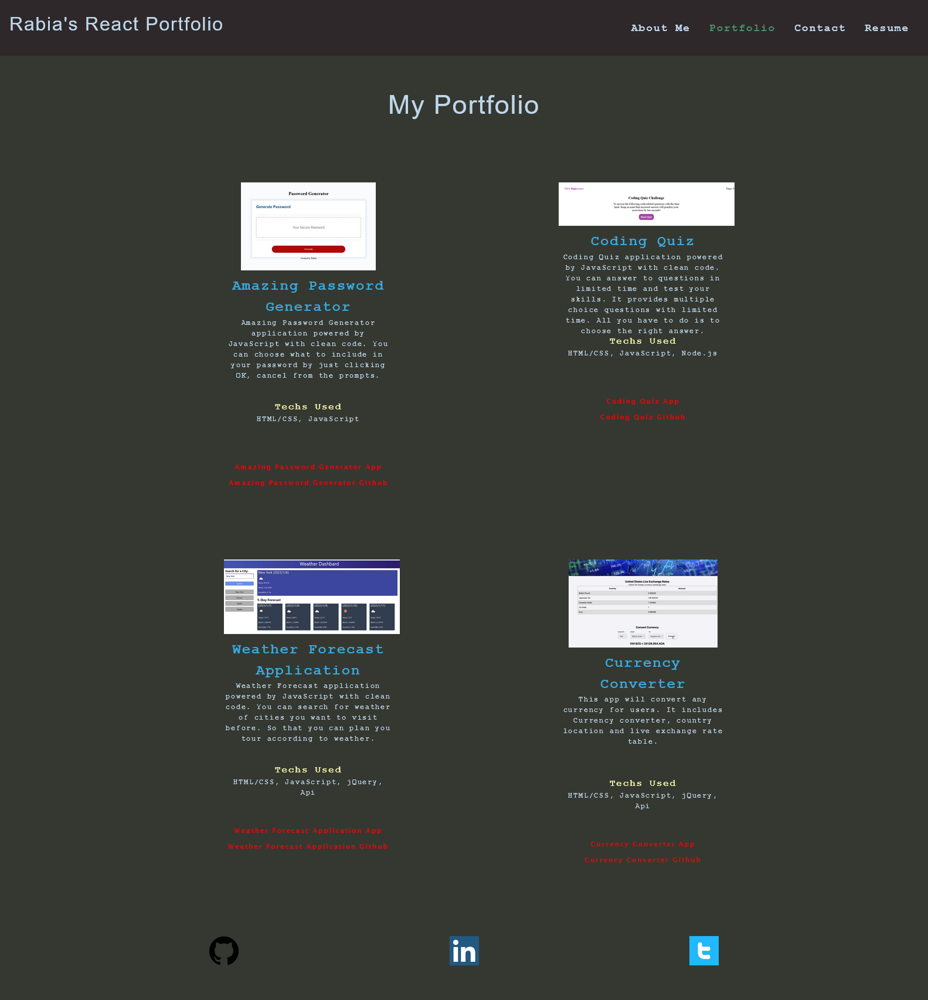
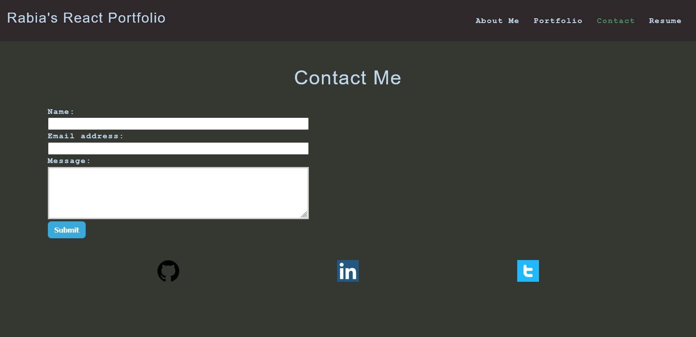
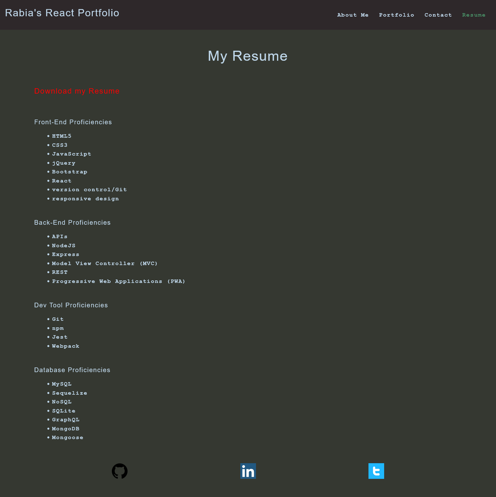

# React Portfolio

## Description
This is my portfolio, created using React.js. I've designed it to include several key sections that highlight my skills and experience, including an About page, a Portfolio page, a Contact page, and a Resume page.

On the homepage, I'll introduce myself and my skills, using a warm welcome message to greet visitors. I'll also include a professional photo of myself to add a personal touch, and a brief summary of my experience and qualifications. Lastly, I'll include a call to action that encourages visitors to explore my portfolio or contact me directly.

The About page provides a more detailed background of my professional experience and education, along with a summary of my skills and areas of expertise. To add a personal touch, I'll share a few details about my hobbies or interests. I'll also include a photo of myself to add a personal touch.

On the Portfolio page, I'll showcase a selection of my best projects and provide brief descriptions of each. To help visitors understand the scope and quality of my work, I'll include screenshots or videos of each project, along with details about my role, any challenges or successes, and any unique or innovative features of each project.

The Contact page includes a contact form that visitors can use to reach out to me directly. In addition, I'll provide my email address and phone number for direct contact. To make it easy for visitors to connect with me on social media, I'll add links to my social media profiles, such as LinkedIn or Twitter. Lastly, I'll encourage visitors to reach out for more information or to discuss potential opportunities.

On the Resume page, I'll provide a link to my resume in a prominent location. I'll include a brief summary of my work experience and education, along with a list of my technical skills and areas of expertise. Lastly, I'll highlight any certifications or relevant training that I've completed.

In the footer of my portfolio, I'll include links to my Github, LinkedIn, and Twitter profiles, along with any additional social media profiles or online portfolios that I maintain. I'll encourage visitors to connect with me on social media or follow my work for updates and insights into my professional experience.

Overall, I've designed my portfolio to showcase my skills, experience, and personality in a clear and engaging way. I hope you enjoy exploring my work!

## Developer Insights:

I am thankful to my instructors at RutgersCodingBootcamp, that they teach me so well and I have crated this coding application.

## How to run:

You can run the application by opening the terminal in your MAC and type following:

1: NPM INSTALL

2: NPM RUN START

## Screenshot

### Home Page

### Portfolio Page

### Contact Page

### Resume Page

## Author
https://github.com/rabia-desing